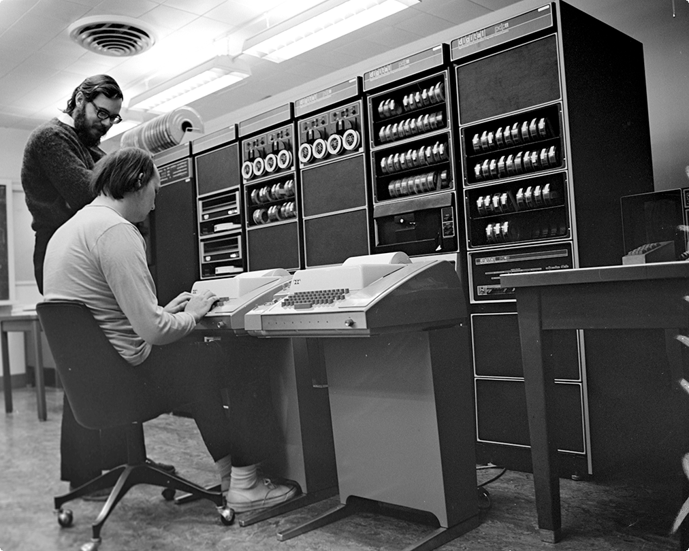

Langage de programmation structuré, mais de bas niveaux, permettant de manipuler dynamiquement les espaces mémoire avec des pointeurs, offrant des types primitifs, et très performant grâce à une implémentation de ses compilateurs près du processeur.

# Historique

En 1969, dans les laboratoires de Bell, Ken Thompson développe un système d'exploitation qui deviendra le très célèbre UNIX.

Développé en Assembleur, le système d'exploitation devient difficile à maintenir et à faire évoluer. Thompson, ne trouvant pas d'alternatives existantes viables, conçut, avec l'aide de Denis Ritchie, le langage B. Mais celui-ci n'aboutit pas convenablement pour la réécriture du système UNIX. En 1971, Denis Ritchie entreprit donc de faire évoluer le langage B, pour devenir le langage C.

AT\&T, principal commanditaire des laboratoires Bell, oeuvrait dans le domaine des systèmes téléphoniques et, à l'époque, une loi lui interdisait de commercialiser autre chose. Ainsi, en 1975, le système d'exploitation UNIX complet, incluant son code source, fut distribué dans les universités à des fins éducatives.

C'est ainsi que le langage C devint l'un des plus utilisés dans le domaine des technologies de l'information.

# Compilation

Le code source, écrit avec un langage de programmation, n'est pas compréhenssible par une machine. Celui-ci doit être traduit, ce que l'on nomme la compilation, afin de créer un programme pouvant être exécuté par un ordinateur:

# Sources

Le code source d'un programme en langage C est stocké dans des fichiers textes ayant, habituellement, « .c » comme extension.

## Commentaires

Tout ce qui suit les caractères « // » sur une ligne est ignoré par le compilateur:

