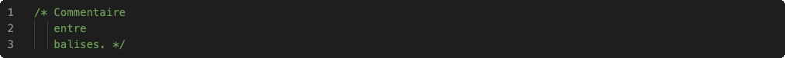
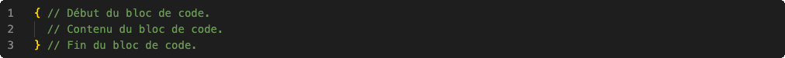

Langage de programmation structuré, mais de bas niveaux, permettant de manipuler dynamiquement les espaces mémoire avec des pointeurs, offrant des types primitifs, et très performant grâce à une implémentation de ses compilateurs près du processeur.

# Historique

En 1969, dans les laboratoires de Bell, Ken Thompson développe un système d'exploitation qui deviendra le très célèbre UNIX.

Développé en Assembleur, le système d'exploitation devient difficile à maintenir et à faire évoluer. Thompson, ne trouvant pas d'alternatives existantes viables, conçut, avec l'aide de Denis Ritchie, le langage B. Mais celui-ci n'aboutit pas convenablement pour la réécriture du système UNIX. En 1971, Denis Ritchie entreprit donc de faire évoluer le langage B, pour devenir le langage C.

AT\&T, principal commanditaire des laboratoires Bell, oeuvrait dans le domaine des systèmes téléphoniques et, à l'époque, une loi lui interdisait de commercialiser autre chose. Ainsi, en 1975, le système d'exploitation UNIX complet, incluant son code source, fut distribué dans les universités à des fins éducatives.

C'est ainsi que le langage C devint l'un des plus utilisés dans le domaine des technologies de l'information.

# Compilation

Le code source, écrit avec un langage de programmation, n'est pas compréhensible par une machine. Celui-ci doit être traduit, ce que l'on nomme « compilation », afin de créer un programme pouvant être exécuté par un ordinateur:

# Sources

Le code source d'un programme en langage C est stocké dans des fichiers textes ayant, habituellement, « .c » comme extension.

## Commentaires

Tout ce qui suit les caractères « // » sur une ligne est ignoré lors de la compilation:

Tout ce qui est encadré des balises « /* » et « */ » est aussi ignoré lors de la compilation:

## Blocs

Un bloc de code est initié par une accolade ouvrante et terminé par une accolade fermante:

# Données

En informatique, c'est le système binaire qui est utilisé pour représenter les données. Il n'est donc pas possible de différencier ces données, puisque tout est un amas de 0 et de 1.

## Types

Le langage C offre quelques types primitifs afin de préciser le type des données ainsi que leur plage de valeurs:

|Type  |Langage C|Taille  |Littéral           |
|------|---------|--------|-------------------|
|Entier|char     |1 octet |42 ou '*'          |
|      |short    |2 octets|32767              |
|      |int      |4 octets|2147483647         |
|      |long     |8 octets|9223372036854775807|
|Réel  |float    |4 octets|3.1415926          |
|      |double   |8 octets|3.141592653589793  |

Il est possible de préciser, pour les types entiers, que les valeurs peuvent qu'être positives, permettant de représenter de plus grandes valeurs:

|Langage C     |Taille  |Litéral             |
|--------------|--------|--------------------|
|unsigned char |1 octet |255                 |
|unsigned short|2 octets|65534               |
|unsigned int  |4 octets|4294967294          |
|unsigned long |8 octets|18446744073709551614|

### Définitions de type

L'identificateur de certains types n'est parfois pas assez révélateur au niveau du type de donnée et de sa taille. Il est possible de créer des alias de ces types:

*Même s'il s'agit du même type de données, la taille est plus claire, et il est plus simple de différencier les valeurs entières (en utilisant « byte ») des valeurs caractères (en utilisant « char »).*
