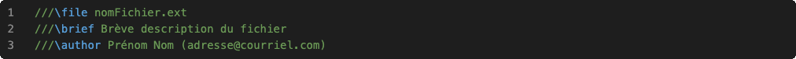
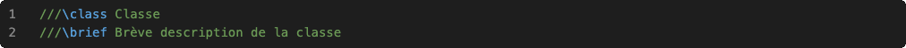

Le code source doit être documenté dans toutes les remises.

# Fichiers

Les fichiers contenant du code source doivent être documentés:

## Classe

Les déclarations de classe doivent être documentées:

### Données membres

Toutes les déclarations de donnée membre doivent être documentées:

### Méthodes

Les déclarations de méthode doivent être documentées:

