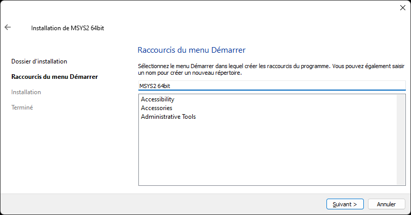

# MSYS2

Système de distribution d'outils de développement.

## Téléchargement

Téléchargez et exécutez le [programme d'installation](https://www.msys2.org/).

## Installation

### Mise à jour

...

### Outils de développement

...

### Librairie graphique

...
