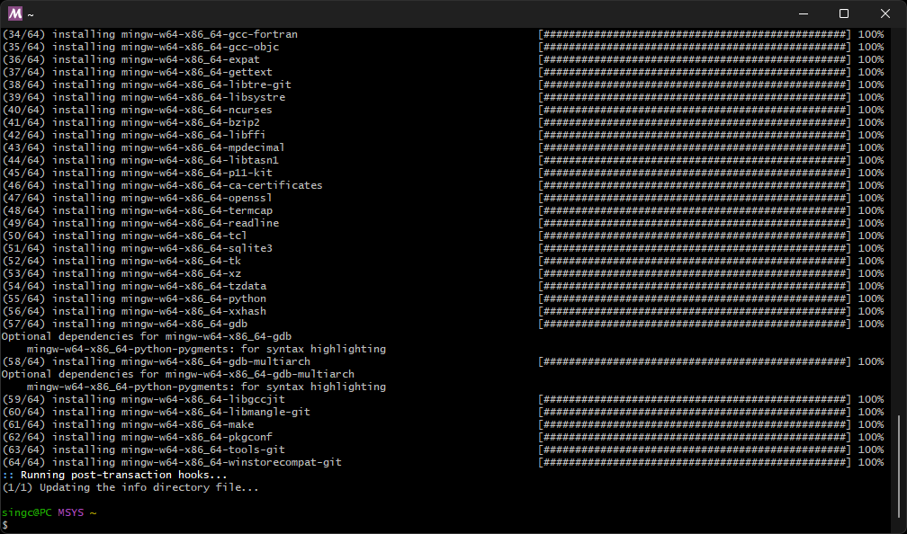

# MSYS2

Système de distribution d'outils de développement.

## Téléchargement

Téléchargez et exécutez le [programme d'installation](https://www.msys2.org/).

## Installation


### Mise à jour

Pour s'assurer que le système est à jour, saisissez l'instruction suivante:

```
pacman -Suy
```


Appuyez sur la touche « Entrée (Enter) »:


### Outils de développement

Pour installer les outils de développement, saisissez l'instruction suivante:

```
pacman -S --needed base-devel mingw-w64-x86_64-toolchain
```


Appuyez sur la touche « Entrée (Enter) »:


Appuyez sur la touche « Entrée (Enter) »:


Appuyez sur la touche « Entrée (Enter) »:



### Librairie graphique

...
