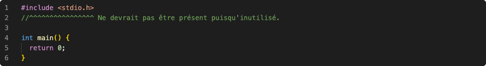
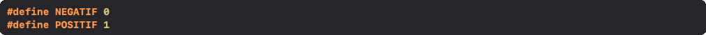
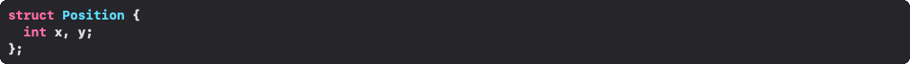
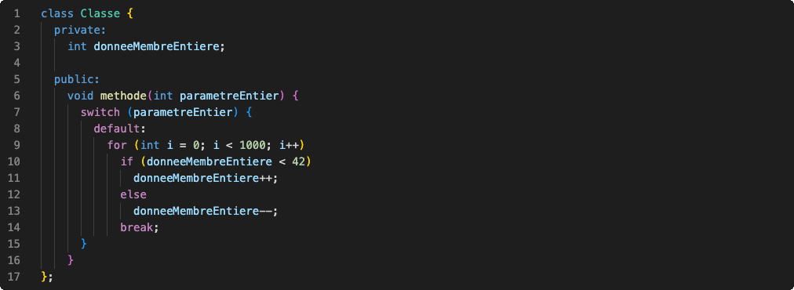
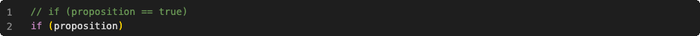
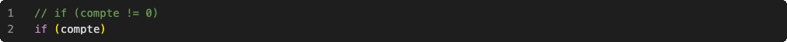
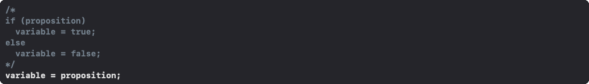

Les normes de programmation ci-dessous doivent être respectées dans toutes les remises.

# Inclusions

Limiter les inclusions à ce qui est nécessaire au code présent dans le fichier:

# Identification

Les identificateurs de constante et variable doivent être significatifs.

## Constante

Les caractères des identificateurs de constantes doivent tous être majuscules:

## Variables

Les identificateurs de variables doivent utiliser la casse de chameau, c'est-à-dire commencer par un caractère minuscule, et utiliser un caractère majuscule pour commencer les mots suivants:

## Structure

Les identificateurs de structure doivent aussi utiliser la casse de chameau, mais débuter par un caractère majuscule:

# Indentation

Les indentations doivent être de 2 espaces suite aux accolades ouvrantes, aux modificateurs d'accès, aux if, aux else, aux while, aux for et aux case:

# Pléonasmes

Quelques pléonasmes de programmeur à éviter:

## Structure conditionnelle

*Puisque les instructions d'une structure conditionnelle sont exécutées si la proposition est vraie.*

*Puisque la valeur 0 représente faux, tandis que toutes autres valeurs représentent vraie.*

*Puisqu'une proposition est toujours de type booléen.*

# Aération

Les gros morceaux de code doivent être séparés en paragraphes, avec un seul saut de ligne entre chacun, afin d'être plus agréables à lire.

Tous les opérateurs, outre les opérateurs unaires, doivent être précédés et suivis d'un espace.

# Commentaires

Les morceaux de code non triviaux ou redondants doivent être commentés afin d'expliquer leur algorithme.
