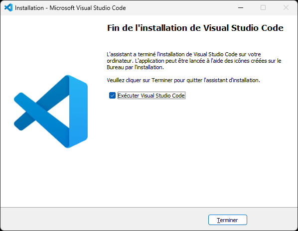

# Visual Studio Code

Éditeur de code.

## Téléchargement

Téléchargez et exécutez le [programme d'installation](https://code.visualstudio.com/#alt-downloads).

## Installation

Lire et accepter les termes, et cliquez sur le bouton « Suivant »:

Cliquez sur le bouton « Suivant »:

Cliquez sur le bouton « Suivant »:

Sélectionnez toutes les options et cliquez sur le bouton « Suivant »:

Cliquez sur le bouton « Installer »:

Veuillez patienter:

Cliquez sur le bouton « Terminer ».

### Extensions

...